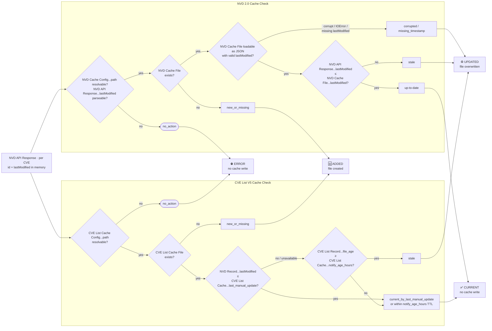
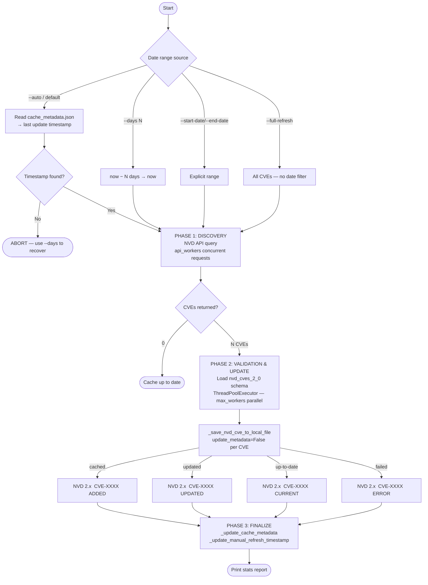
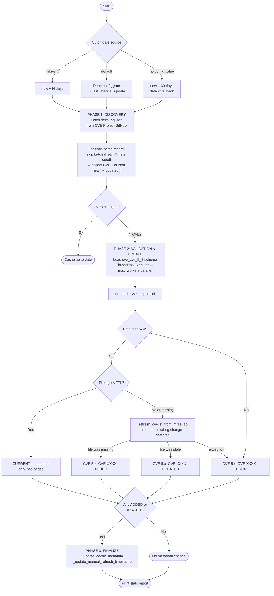

# NVD CVE & CVE List V5 Cache System - Reference Documentation

---

## Overview

Per-file cache system for NVD 2.0 CVE records (`cache/nvd_2.0_cves/`) and CVE List V5 records (`cache/cve_list_v5/`). Both caches are populated during bulk dataset generation and kept current through standalone refresh utilities.

Each cache uses a different staleness strategy:
- **NVD 2.0**: Timestamp comparison — API `lastModified` vs cached `lastModified`
- **CVE List V5**: Fast path via `last_manual_update` config field; fallback to file-age TTL (`notify_age_hours`)

---

## Configuration

Both caches are configured under `cache_settings` in `config.json`:

```json
"cve_list_v5": {
    "path": "cache/cve_list_v5",
    "refresh_strategy": {
        "last_manual_update": "1970-01-01T00:00:00+00:00",
        "notify_age_hours": 720
    }
},
"nvd_2_0_cve": {
    "path": "cache/nvd_2.0_cves",
    "refresh_strategy": {
        "field_path": "$.vulnerabilities.*.cve.lastModified"
    }
}
```

`last_manual_update` is set manually after a bulk CVE List V5 refresh to serve as a high-water mark, allowing the fast path to skip file I/O for CVEs that predate it. `notify_age_hours` (default: 720h) is the TTL fallback when the fast path is unavailable.

---

## Bulk Generation Cache Check — `generate_dataset.py`

During bulk operations, every CVE returned by the NVD API is evaluated against both caches before any disk writes occur. Writes are batched in memory and flushed once per NVD API response page, so `_update_cache_metadata` is called at most once per page rather than once per CVE.

**Implementation**: [`generate_dataset.py`](../generate_dataset.py)
- `_save_nvd_cve_to_cache_during_bulk_generation()` — NVD 2.0 staleness check and queue
- `_save_cve_list_v5_to_cache_during_bulk_generation()` — CVE List V5 staleness check and queue
- `_flush_cache_batches()` — drains both queues; called after each page loop and on interrupt

### Cache Check Logic



### Outcome Reference

| Outcome | Reason(s) | Cache Write |
|---------|-----------|-------------|
| ⛔ ERROR | `path_resolution_failed`, `missing_timestamp`, `timestamp_parse_error`, `error` | No |
| 🆕 ADDED | `new_or_missing` | Yes — file created |
| ♻️ UPDATED | `stale`, `corrupted`, `missing_timestamp` | Yes — file overwritten |
| ✅ CURRENT | `up-to-date`, `current_by_last_manual_update` | No |

---

## Standalone Cache Refresh Utilities

### NVD 2.0 CVE Cache Refresh

**Entry point:** `python -m utilities.refresh_nvd_cves_2_0_cache`

Queries NVD for CVEs modified within a date range and writes/updates cache files using parallel workers. Schema validation (`nvd_cves_2_0`) runs before each write. Cache metadata and `lastManualUpdate` are updated once in Phase 3 rather than per-CVE.

**When to use:** Initial cache population, recovery after API failures, or proactive cache warming as a supplement to `generate_dataset.py`.

| Option | Description |
|---|---|
| *(no args)* / `--auto` | Read last update from `cache_metadata.json` (**default**) |
| `--days N` | Refresh CVEs modified in the last N days |
| `--start-date YYYY-MM-DD --end-date YYYY-MM-DD` | Explicit date range |
| `--full-refresh` | Query entire NVD dataset — no date filter (30–60 min) |
| `--workers N` | Parallel CVE processing workers (default: 20) |
| `--api-workers N` | Concurrent NVD API requests (default: 15) |



### CVE List V5 Cache Refresh

**Entry point:** `python -m utilities.refresh_cve_cvelist_5_2_cache`

Fetches `deltaLog.json` from the CVE Project GitHub repository to identify CVEs changed since a cutoff date, then refreshes only those whose cache files are stale (age ≥ `notify_age_hours` TTL). `last_manual_update` in `config.json` is written automatically in Phase 3 when any CVEs are written; subsequent default runs read this value to narrow the deltaLog scan.

**When to use:** Routine scheduled maintenance and baseline establishment after a fresh clone. CURRENT CVEs (within TTL) are skipped silently — only stale or missing files are fetched from the MITRE API.

| Option | Description |
|---|---|
| *(no args)* | Auto-detect cutoff from `config.json` → `last_manual_update` (**default**) |
| `--days N` | Force cutoff to N days ago regardless of config state |
| `--workers N` | Parallel workers for CVE fetching (default: 20) |


